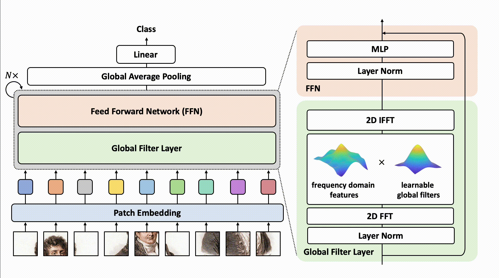
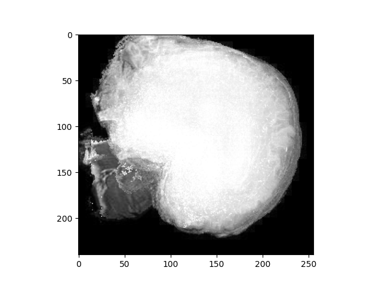
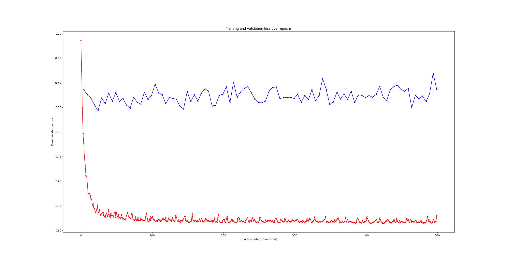

# GFNet Classification of ADNI Data
COMP3710 Project\
Isaac Toombes, 48027782\
Semester 2 2025 

## Alzheimer's Disease Neuroimaging Initiative (ADNI)
The ADNI dataset [1] was used as-provided on the UQ Rangpur cluster computer, in the `/home/groups/comp3710/ADNI` folder.
The data consists of 35,200 256×240 8-bit grayscale MRI scans, in `.jpeg` format.
The data is split into two groups - `test` and `train`, and then further partitioned into `AD` (Alzheimer's disease) and `NC` (cognitive normal) subsets.
Each file is labelled in the format `<patient id>_<image number>.jpeg`, where a patient can appear multiple times in the same dataset.

## Global Filter Network (GFNet) Architecture

Global filter networks function by replacing the self-attention layer in vision transformers with Fourier transforms[2].
More explicitly, the GFNet model defines a 'Global Filter', which takes its input data, transforms it into the frequency domain, multiplies it with learnable filters, inverse Fourier transforms the data back to the original space.
The outputs of the Global Filter layers are then then run through Multi-Layer Perceptrons (MLPs) [2]. 
A visual overview of this architecture is as follows [2]:

Note that in addition to the Global Filter and MLP blocks, there is a patch-embedding layer, several normalisation layers, an average pooling layer, and a linear layer.
The patch-embedding layer works as it does in a vision transformer; it breaks the input image into distinct 'patches', before flattening and projecting them onto the embedding dimension [2].
However, unlike in a vision transformer, there is no additional class token. 
Implementations of these blocks are available in the GFNet GitHub repository [2].

The purpose of this project is to adapt the GFNet architecture to classify observations in the ADNI dataset into either 'cognitive normal' or 'Alzheimer's detected' classes, with a desired minimum level of accuracy of $80\%$.

## Software Requirements 

### Python & CUDA versions 
 - Python 3.13.9
 - CUDA 13.0

### Packages:
A `pip`-readable list is in the [`requirements.txt`](./requirements.txt) file.
- anyio             4.11.0
- certifi           2025.10.5
- click             8.3.0
- colorama          0.4.6
- contourpy         1.3.3
- cycler            0.12.1
- filelock          3.19.1
- fonttools         4.60.1
- fsspec            2025.9.0
- h11               0.16.0
- hf-xet            1.2.0
- httpcore          1.0.9
- httpx             0.28.1
- huggingface-hub   1.0.0
- idna              3.11
- Jinja2            3.1.6
- kiwisolver        1.4.9
- MarkupSafe        2.1.5
- matplotlib        3.10.7
- mpmath            1.3.0
- networkx          3.5
- numpy             2.3.4
- packaging         25.0
- pandas            2.3.3
- pillow            12.0.0
- pip               25.3
- pyparsing         3.2.5
- python-dateutil   2.9.0.post0
- pytz              2025.2
- PyYAML            6.0.3
- safetensors       0.6.2
- setuptools        70.2.0
- sh ellingham       1.5.4
- six               1.17.0
- sniffio           1.3.1
- sympy             1.14.0
- timm              1.0.21
- torch             2.9.0+cu130
- torchvision       0.24.0+cu130
- tqdm              4.67.1
- typer-slim        0.20.0
- typing_extensions 4.15.0
- tzdata            2025.2
## Data Pre-processing
For compatability with PyTorch modules, each image was converted from the standard unsigned 8-bit representation to a scaled `torch.float32` datatype (all values within the range 0-1).
This decision was made in accordance with the PyTorch API.

Each image in the ADNI dataset individually contains a large proportion of blank space around the area of interest, indicating that cropping may be useful.
However, by combining the images together (taking the maximum value across every image for every pixel), it becomes apparent that the data is spread in such a way to make this infeasible:

Instead, the blank spaces, variable size of scans, and positions within the image will be kept.
This should hopefully improve the model's generalisation, as the areas of interest in the model will change with every iteration.

## Creation of a validation data set
It was decided to select a subset of the training set to create a validation dataset, and provide an indication of the model's performance over training iterations.
To avoid contamination of data, the following process was used:
 - The training `AD` and `NC` datasets were further partitioned based on patient ID
 - 20% of the patient ID's in the `AD` dataset, and 20% of patient ID's in the `NC` dataset, were randomly selected
 - The observations associated with these ID`s were used to create the validation dataset, and removed from the training dataset

## File structure

### dataset.py
Responsible for loading the ADNI data into PyTorch `torch.utils.data.DataLoader` objects.
Loads images via the `torchvision.io.image.decode_image()` method, and applies a `torchvision.transforms.v2.ToDytpe(torch.float32, scale=True)` transform to ensure it is in a compatible format with the GFNet modules.

The following key methods are available:
 - `get_test_dataloader()`, which returns a `DataLoader` created from the `ADNI/AD_NC/test/` folder.
 - `get_validation_and_training_dataloaders()`, which does the following:
    - Randomly splits the `ADNI/AD_NC/train/` folder into a validation and training partitions, by patient ID
    - Returns two distinct `DataLoader`s from these partitions

Note that `get_validation_and_training_dataloaders()` has a `seed` parameter, which can be used to ensure the validation and training split is reproducible.

#### Changing the file location of the ADNI dataset:
 - The `ADNI_ROOT` variable in `dataset.py` is used as the location of the ADNI dataset
 - By default, it is set to `/home/groups/comp3710/data/ADNI/`

### modules.py
Contains `torch.nn.Module()` subclasses adapted from the original GFNet GitHub page [2], namely:
 - `PatternEmbed()`, which segments an input image into a pattern and embeds it into a one-dimensional 'embedded' space
 - `GlobalFilter()`, which takes an input, performs a discrete Fourier transform, multiplies it by a learnable weight, and then performs an inverse Fourier transform back to the original input size
 - `MultiLayerPerceptron()`, which uses two fully connected layers with a Gaussian Error Linear Unit activation function
 - `GFNetBlock()`, which stacks a `MultiLayerPerceptron()` module on a `GlobalFilter()` module, with layer normalisation between the modules.
 - `GFNet()`, which is the actual GFNet implentation:
    - Input is first fed through a `PatchEmbed()` module
    - It is then position-embedded with a set of learnable parameters (`torch.nn.Parameter()`)
    - The embedded space is then fed through $n$ `GFNetBlock()` modules
    - The output from the last `GFNetBlock()` is then normalised and average-pooled (using `torch.nn.LayerNorm()` with `torch.mean()`)
    - Finally, the output is run through a `torch.nn.Linear()` and `torch.nn.Sigmoid()` module, to get the final model classification

Note that the model weights are initialised stochastically, meaning that results may not always be reproducible.
### train.py
Responsible for the training, validation, and testing of a GFNet model.
Model hyperparameters, the save location of model statistics & parameters, and the seed used to determine the validation split, are controlled using global variables.

The file implements the following methods:
 - `train_model()`, whch implements the model training cycle. Note that the optimiser and loss functions are defined here.
 - `evaluate()`, which determines the accuracy of a trained model. Note that the function expects the loaded model to have the same hyperparameters as defined in the `train.py` file. 
 - `visualise()`, which generates MatPlotLib diagrams of the model's training and validation scores over its epochs. 

 #### Training a model, visualising training, and model evaluation:
 - To train a model, run `py train.py` with no arguments
 - Once a model has been trained, run:
    - `py train.py eval`, to generate the model's test statistics.
    - `py train.py vis`, to visualise the model's loss and validation score over time

### predict.py
Runnable file which returns the predicted probability that a sample image belongs to either the 'Alzheimer's detected' or 'cognitive normal' class.
Requires that the model has already been trained, and uses the same hyperparameters as defined in `train.py`.

Expects to be run as `py predict.py <path_to_image>`, and returns on the console.

## Training & evaluating a model
 - If not using Rangpur, change the `ADNI_ROOT` variable in the `dataset.py` file to the location of the ADNI folder
 - Run `py train.py` to train a model
   - Global variables within `train.py` control:
     - Hyperparameters
     - File save locations
 - Once a model has been trained:
   - Run `py train.py eval` to get accuracy statistics
   - Run `py train.py vis` to visualise training & validation loss over time
 - Run `py predict.py <image_path>` to classify an ADNI image with the trained model.

## Training approach
It was decided to perform model training on a local Nvidia RTX 3070, as it was anticipated that the UQ Ranpgur cluster would be under heavy load.
To that end, the reason why GFNet was selected as a model archicture to begi with was due to its claimed efficiency benefits in comparison to equivalent models, such as convolutional neural nets and vision transformers.

The GFModel used in training was based on the `gfnet-ti` model on the GFNet GitHub page [2], as it was found that models of a larger size (i.e., `gfnet-xs`) were too demanding on the available VRAM.
This uses an embedded dimension of $256$, an embedded dimension to MLP ratio of $4$, and a depth of $12$ global fliter to MLP blocks. 
Key modifications to the orignial `gfnet-ti` implementation are: 
 - Adjusting the input to fit a 256 $\times$ 240 8-bit grayscale image
 - Changing from multi-class to binary classification
 - The addition of dropout, as early tests indicated a significant amount of dropout

Two optimisers were used with the approach, based on the default optimiser used for the original GFNet [2].
Both use the `torch.optim.AdamW` implentation of the AdamW optimiser, which is a variant Adam optimiser with decoupled weight decay.
All parameters in the model were given a weight decay amount of $0.05$, except for the position-embedding weights which had no weight decay.
The default first-order and second-order momentums were used, at $0.9$ and $0.99$ respectively.
Cross entropy was used as the loss function.

The difference between the optimisers were in the learning rate. One optimiser used the default learning rate of $0.001$, while the other used a `torch.optim.lr_scheduler.CosineAnnealingLR` learning rate scheduler, with a minimum learning rate of $0.0005$ and a period of 40 training epochs.

### Initial results
Note that the number of epochs for each training method was made arbitrarily, and based on the amount of time available for the training process.

#### Constant learning rate:

Validation Accuracy: 76.21%
Training Accuracy: 98.41%
Test Accuracy: 60.97%
True positive: 2548
False negative: 1912
True negative: 4851
False positive: 0
Recall: 0.5713004484304933
Precision: 1.0
F1 score: 0.7271689497716896

#### Variable learning rate:

### Retraining based on original tests

## References
[1] Alzheimer's Disease Neuroimaging Initiative, "ADNI | Alzheimer's disease neuroimaging initiative," 2025. [Online] [https://adni.loni.usc.edu/](https://adni.loni.usc.edu/)

[2] Y. Rao, W. Zhao, Z. Zhu, J. Zhou, and J. Lu, "Global Filter Networks for Image Classification," 2021, arXiV: 2107.00645. [Online] [https://arxiv.org/abs/2107.00645](https://arxiv.org/abs/2107.00645)1`